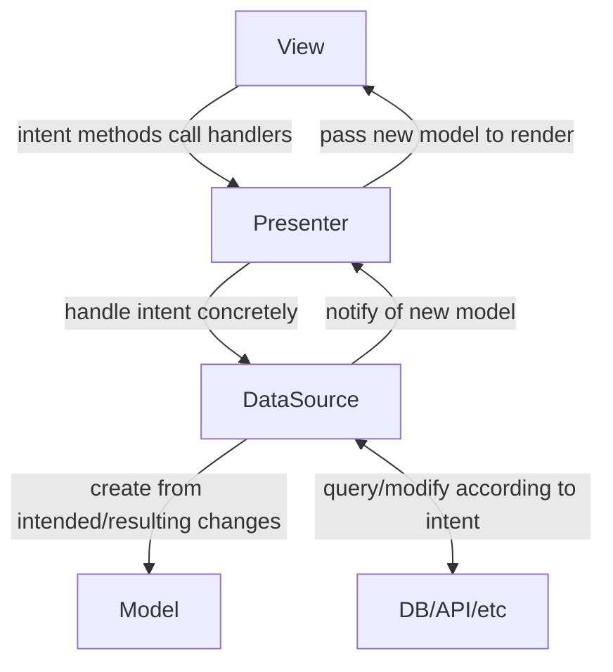

# fletched

An opinionated framework on top of flet,
designed to significantly reduce boilerplate code
and aid in structuring a non-trivial project.

If flet were an arrow,
fletched would give it feathers,
enabling you to aim and hit way further.

For now, it offers two libraries/submodules:
`mvp` and `routed_app`,
which were originally separate projects.
They are designed to work well in conjunction,
but should you only want to use one of them,
that will work as well.

- [fletched](#fletched)
  - [mvp](#mvp)
    - [Architecture / API](#architecture--api)
    - [Usage](#usage)
      - [View](#view)
      - [Presenter](#presenter)
      - [DataSource](#datasource)
      - [Model](#model)
      - [Validation / error handling](#validation--error-handling)
  - [routed-app](#routed-app)
    - [When will I need this?](#when-will-i-need-this)
    - [How do I use this?](#how-do-i-use-this)
      - [ViewBuilder class](#viewbuilder-class)
      - [Route assignment](#route-assignment)
      - [Route protection](#route-protection)
      - [Aggregating ViewBuilder classes](#aggregating-viewbuilder-classes)
      - [RoutedApp usage](#routedapp-usage)
      - [App state](#app-state)

## mvp

This library provides tools that make it a bit easier
to follow architecture patterns in your flet app
that leverage on immutable models and unidirectional control flow.
Those are mostly based on the Model-View-Presenter/MVP pattern,
hence the name of the library.
At this stage,
it can be used to ease working with any model-based architecture pattern though.

### Architecture / API



One of the main goals of this library
is to reduce the amount of boilerplate code that is needed
in order to implement an MVP-based architecture for flet apps.
This should however not come at the cost of typechecking and autocomplete.
That is why for each class you will interact with,
the general way of doing things stays the same:

```python
class MyClass(LibraryClass):
    variable_needed_by_library_class_and_this_class: MyOtherClass

    def some_method(self):
        ...
```

This approach solves the following problem:
In order to do their helpful work behind the scenes,
the library classes need to access objects
that the concrete subclasses receive or create,
e.g. the DataSource in MvpPresenter implementations.
MvpPresenter can only know that the DataSource is an instance of MvpDataSource,
so a subclass accessing a `self.data_source` variable set in the parent class
(how it is set is more or less irrelevant) would not know anymore than that
and thus your IDE can't properly autocomplete for you anymore.

There is a bit of magic
(namely abstract class properties and a bit of dataclass wizardry)
going on behind the scenes that makes this work,
but it should save you from ever having to write an `__init__()` method
while still getting helpful autocomplete in `MyClass` for
`variable_needed_by_library_class_and_this_class`,
which itself will be autocompleted for you when defining `MyClass`.
It also makes the approach more declarative rather than imperative,
which some developers might prefer (or so I've heard).

### Usage

Say you have a form and want to validate the TextFields in it
when a submit button is clicked.

#### View

Your view uses [refs](https://flet.dev/docs/guides/python/control-refs/).
The actual UI code may be located somewhere else
and simply receive the refs and/or callbacks
and return a component that is connected to the ref.
When creating the view class, you inherit from `MvpView`
and create a class variable named `ref_map`,
containing a dictionary that maps the attribute names
of your model to the respective ref
of the control that should be tied to it.
Any variable intended for the `flet.View` constructor will be accepted
and passed on by the default `__init__()` method,
so you don't need to define your own in most cases.

You will also need to define a `config` class variable,
where you define things such as horizontal alignment,
appbar and other parameters for the parent `flet.View`.
The `ViewConfig` dataclass is included for this purpose.

```python
import flet as ft

from fletched.mvp import MvpView, ViewConfig


class FormView(MvpView):
    ref_map = {
            "last_name": ft.Ref[ft.TextField](),
            "first_name": ft.Ref[ft.TextField](),
            "age": ft.Ref[ft.TextField](),
        }
    config = ViewConfig(
        vertical_alignment=ft.MainAxisAlignment.CENTER,
        horizontal_alignment=ft.CrossAxisAlignment.CENTER,
    )

    def some_intent_method(self, e) -> None:
        ...
```

`MvpView` has a `render(model)` method that takes a model
and updates any refs' current value to the model value if they aren't the same.
This method is supposed to be called in the callback
you register with the DataSource,
so that a changed model is immediately reflected in the view.
As you will learn in the next section,
this doesn't have to concern you as it can be done automatically.

#### Presenter

Any class that inherits from `MvpPresenter` updates the view automatically
once it is notified of a model update.
`MvpPresenter` is a dataclass
and so should its subclasses be.
This helps to reduce the amount of boilerplate code
(specifically `__init__()` methods) you have to write
and keeps the general API of this library consistent.
Since both the DataSource and the View are known to it
(because the subclass fields override the fields of the same name in the superclass),
`MvpPresenter` will automatically register a method as a callback with the DataSource
that renders the new model in the given view in its `__post_init__()` hook.

```python
from dataclasses import dataclass
from fletched.mvp import MvpPresenter

from my_package.views.form import FormDataSource, FormViewProtocol


@dataclass
class FormPresenter(MvpPresenter):
    data_source: FormDataSource
    view: FormViewProtocol

    def some_intent_handling_method(self) -> None:
        ...
```

`MvpPresenter` also provides a generic `build()` method
that simply calls the `build(presenter)` method of the view
with itself as the sole argument.
If you need a custom build method for your presenter,
just override it with your own.

#### DataSource

The DataSource class, inheriting from `MvpDataSource`,
is where the business logic of your component/virtual page will live.
Since the latter inherits from `Observable`,
brokers of any kind (presenter classes in MVP-based architectures)
can register callback functions with your DataSource class
that will be executed when you call `self.notify_observers()` in it.
As mentioned above, subclasses of `MvpPresenter` do this for you automatically
after you initialized them properly.

These callbacks are meant to be used to inform a presenter that a new,
updated model has been created.
Since creating new models to replace the current one is a rather repetitive
and uniform task,
`MvpDataSource` will do it for you.
All you have to do is pass your model class to its constructor
and call `self.update_model_partial(changes: dict)`
or `self.update_model_complete(new_model: dict)` depending on your use case.

```python
from fletched.mvp import MvpDataSource


class FormDataSource(MvpDataSource):
    current_model = FormModel()

    def some_method(self) -> None:
        ...
```

#### Model

The model is supposed to act as the state of your view.
It should contain everything the view needs to know
in order to render/update itself.
This can be data from a database, an API,
a config file or even just another component.

Your model inherits from `MvpModel`,
which is an immutable pydantic BaseModel.
This means you can write custom validators for each attribute
and validate all your data whenever a new instance of the model is created.

The model is immutable to force good habits upon the ones using it.
Good habits in this context means not to modify your current model anywhere
but in your DataSource class as that should be the single source of truth.
Of course immutability is never enforced 100% in python,
but this should suffice.

```python
from fletched.mvp import MvpModel


class FormModel(MvpModel):
    last_name: str = ""
    first_name: str = ""
    age: int = 0
```

#### Validation / error handling

Notice that `age` is an `int`,
even though the ref we assigned to it earlier points to a TextField?
That's no problem at all,
you'll have to do no manual conversion.
Pydantic will parse the text input into an `int`
and raise an error if that fails.
We probably want to inform our user though that they have input invalid data.
To do this, we'll simply typehint `age` differently.

```python
from fletched.mvp import ErrorMessage, MvpModel


class FormModel(MvpModel):
    last_name: str = ""
    first_name: str = ""
    age: ErrorMessage | int = 0
```

> It's important to specify the narrower type (ErrorMessage) first,
> otherwise every error message would just say
> that the field is not an instance of ErrorMessage.

This is where the magic of the update_model methods of `MvpDataSource` comes to light.
If the creation of a new model fails,
e.g. because a user put "old" into the age TextField instead of a number,
our DataSource will now catch this error,
wrap its message in an `ErrorMessage` object
and assign it to the age field
of a new model that contains all changes,
both the valid inputs and the error mesages.
Multiple errors at once are no problem at all,
each ErrorMessage will be assigned to the field that caused it.

Since we probably don't want to make any calls to a database, API etc. in that case,
the update_model methods will return a bool
to let you know if there was an error.

The subscribed observers will be notified either way
and the model will thus be rendered.
`MvpView.render()` will try to assign fields that are instances of `ErrorMessage`
to the `error_text` property of the control that the associated ref points to.
This means that you should only use this technique for model fields
that are associated with controls that actually have that property,
like TextField or Dropdown.

## routed-app

### When will I need this?

Say you want to design an app for a government agency with multiple,
let's say 20+ pages (MPA = Multi Page Application).
Since Flet is technically SPA (Single Page Application) only,
you'll use views and some routing to simulate the MPA behaviour.

Not every person in the agency should be able to access every page/view.
Also, they shouldn't be able to see anything
but the login page until they're logged in.
The roles defined in the OAuth token the app receives upon login
will determine what pages/views a user has access to.

You'll probably want to design your app in a way that bundles every page/view
into its own module.
If you used an architecture design pattern
(which you definitely should at this scale),
obtaining the view requires building its model
and presenter or controller as well
and thus you need some function or method to obtain the view.

The way flet routing works ATM,
a view will have to be recreated after a route change,
so you'll want to match each route of your app
to the function or method that creates the appropriate view for it.
You'll also want the function/method to return a different view
or raise an exception if the user is not authorized to access it.
This can create a lot of boilerplate code
if you don't have the help of a library.

### How do I use this?

#### ViewBuilder class

In the module of your page/view,
create a file called (something like) `build.py`.
In it, create a class called (something like) `{page_name}ViewBuilder`.
This class should inherit from the `ViewBuilder` class of this library
and at minimum define a method with the signature

```python
def build_view(self, route_parameters: dict[str, str]) -> flet.View
```

This library also contains convenience ViewBuilder subclasses
that provide a shortcut for common architecture design patterns.
The MvpViewBuilder for example only requires you to define three class variables:

```python
from fletched.mvp import MvpViewBuilder

from my_package.views.counter import CounterDataSource, CounterPresenter, CounterView


class CounterViewBuilder(MvpViewBuilder):
    data_source_class = CounterDataSource
    presenter_class = CounterPresenter
    view_class = CounterView
```

#### Route assignment

```python
from fletched.routed_app import route
from fletched.mvp import MvpViewBuilder

from my_package.views.counter import CounterDataSource, CounterPresenter, CounterView

@route("/counter")
class CounterViewBuilder(MvpViewBuilder):
    data_source_class = CounterDataSource
    presenter_class = CounterPresenter
    view_class = CounterView
```

You can use template routes too!
They just have to follow the
[repath](https://github.com/nickcoutsos/python-repath) spec,
which both flet and fletched use under the hood.

```python
from fletched.routed_app import route
from fletched.mvp import MvpViewBuilder

from my_package.views.counter import CounterDataSource, CounterPresenter, CounterView

@route("/counter/:user/count/:id")
class CounterViewBuilder(MvpViewBuilder):
    data_source_class = CounterDataSource
    presenter_class = CounterPresenter
    view_class = CounterView
```

The variables `user` and `id` will automatically be extracted by fletched
and put into the `route_params` dictionary the `build_view()` method
of the ViewBuilder accepts as a parameter.
When no template route is specified or used (parameters can be optional),
that dictionary is empty.
Otherwise, it will contain a mapping of variable names to variable values.
> In the MvpViewBuilder,
> the route_params mapping will automatically be passed to the DataSource.

In case the route we assigned in the code block above gets called like this:
`yourappdomain/counter/23/count/4`,
the route_params dictionary will look like this:
`{"user"="23", "id"="4"}`.
Note that both name and value will be strings,
so you'll have to convert the value
in case it's supposed to be of a different data type.
The repath library allows you to specify a lot of constraints
with the help of regular expressions,
e.g. that a parameter is supposed to consist of 1-3 digits.
If the route the user input
does not match the route template of a given `ViewBuilder`,
a `RoutedApp` will return a simple `PageNotFoundView`.

Due to the limits of regular expressions,
you can not always assume that an input route
that was successfully matched to a route template
satisfies all the constraints the parameters of that route template should have.
The best example for that would be a user ID.
We might be able to specify that it must be a number between 1 and 999,
but we can't ensure this way that the ID actually exists.
That is why it is up to you to handle the error cases that can happen this way.

In general, you probably want to do this in the `build_view()` method
since it is easily possible to return a different view from there.
If you use the `MvpViewBuilder`,
this is done by overriding the `route_params_valid` property
of the `MvpDataSource`, which is defined but not implemented by default.
The `build_view()` method of the ViewBuilder
will automatically create a new DataSource
(and thus a new model/view state)
when the route parameters change
and return the aforementioned `PageNotFoundView`
if the DataSource has a non-empty `route_params` mapping
and the `route_params_valid` property returns `False`.

#### Route protection

```python
from fletched.routed_app import login_required, route
from fletched.mvp import MvpViewBuilder

from my_package.views.counter import CounterDataSource, CounterPresenter, CounterView

@login_required
@route("/counter")
class CounterViewBuilder(MvpViewBuilder):
    data_source_class = CounterDataSource
    presenter_class = CounterPresenter
    view_class = CounterView
```

```python
from fletched.routed_app import group_required, route
from fletched.mvp import MvpViewBuilder

from my_package.views.counter import CounterDataSource, CounterPresenter, CounterView

@group_required("demo")
@route("/counter")
class CounterViewBuilder(MvpViewBuilder):
    data_source_class = CounterDataSource
    presenter_class = CounterPresenter
    view_class = CounterView
```

You can also easily write your own auth decorator,
all it has to do is define a function that returns a bool
and set the `auth_func` attribute
of the ViewBuilder class it wraps to that function.

#### Aggregating ViewBuilder classes

Somewhere in your project, you will have to import all ViewBuilder classes
and aggregate them in a list.
The recommended approach is to do this in the `__init__.py`
of the module that contains all your view modules.

It is also possible to create multiple lists
of different ViewBuilders in different places in your project
and to then add these lists to the app one after another.

#### RoutedApp usage

In your main() function,
create an instance of RoutedApp
and add the previously imported list of ViewBuilder classes to the instance.

```python
import flet as ft

from fletched.routed_app import RoutedApp

from mypackage import views

def main(page: ft.Page):
    app = RoutedApp(page)
    app.add_view_builders(views.view_builders)

ft.app(target=main)
```

#### App state

You can share data between different pages/views
by storing it in the `state` dictionary of the app instance
and retrieving it from there.

`state` is a defaultdict;
if a key does not exist,
it will return the string Literal "not set".

Each ViewBuilder will be passed the app instance
when it is added to that very instance.

If you know exactly which variables you will need to pass at runtime
and you want to have autocomplete in your editor,
you can create custom app and state classes in an `app.py` file like this:

```python
from fletched.routed_app import CustomAppState, RoutedApp


class AppState(CustomAppState):
    test: int = 0
    demo: str = ""


class App(RoutedApp):
    state: AppState = AppState()
```

Please remember to use those throughout your project when typehinting,
otherwise you won't reap the autocomplete benefits.

`CustomAppState` is an empty dataclass which saves you the trouble
of having to import dataclasses and decorate your class
and ensures better type safety for the library.

You will also need to pass the `custom_state=True` flag
when creating the app instance,
so the constructor  of `RoutedApp` knows not to set the `state` class variable
to an empty defaultdict.
