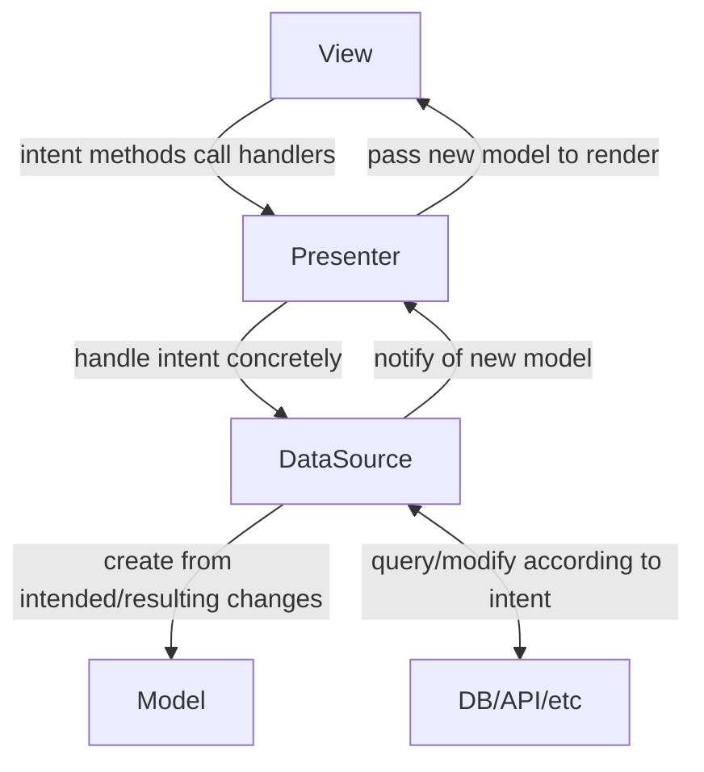

## Introduction

This library provides tools that make it a bit easier
to follow architecture patterns in your flet app
that leverage on immutable models and unidirectional control flow.
Those are mostly based on the Model-View-Presenter/MVP pattern,
hence the name of the library.
At this stage,
it can be used to ease working with any model-based architecture pattern though.

## Architecture / API



One of the main goals of this library
is to reduce the amount of boilerplate code that is needed
in order to implement an MVP-based architecture for flet apps.
This should however not come at the cost of typechecking and autocomplete.
That is why for each class you will interact with,
the general way of doing things stays the same:

```python
class MyClass(LibraryClass):
    variable_needed_by_library_class_and_this_class: MyOtherClass

    def some_method(self):
        ...
```

This approach solves the following problem:
In order to do their helpful work behind the scenes,
the library classes need to access objects
that the concrete subclasses receive or create,
e.g. the DataSource in MvpPresenter implementations.
MvpPresenter can only know that the DataSource is an instance of MvpDataSource,
so a subclass accessing a `self.data_source` variable set in the parent class
(how it is set is more or less irrelevant) would not know anymore than that
and thus your IDE can't properly autocomplete for you anymore.

There is a bit of magic
(namely abstract class properties and a bit of dataclass wizardry)
going on behind the scenes that makes this work,
but it should save you from ever having to write an `__init__()` method
while still getting helpful autocomplete in `MyClass` for
`variable_needed_by_library_class_and_this_class`,
which itself will be autocompleted for you when defining `MyClass`.
It also makes the approach more declarative rather than imperative,
which some developers might prefer (or so I've heard).

## Usage

Say you have a form and want to validate the TextFields in it
when a submit button is clicked.

### View

Your view uses [refs](https://flet.dev/docs/guides/python/control-refs/).
The actual UI code may be located somewhere else
and simply receive the refs and/or callbacks
and return a component that is connected to the ref.
When creating the view class, you inherit from `MvpView`
and create a class variable named `ref_map`,
containing a dictionary that maps the attribute names
of your model to the respective ref
of the control that should be tied to it.

Any variable intended for the `flet.View` constructor will be accepted
and passed on by the default `__init__()` method,
so you don't need to define your own in most cases.

You will also need to define a `config` class variable,
where you define things such as horizontal alignment,
appbar and other parameters for the parent `flet.View`.
The `ViewConfig` dataclass is included for this purpose.

```python
import flet as ft

from fletched.mvp import MvpView, ViewConfig


class FormView(MvpView):
    ref_map = {
            "last_name": ft.Ref[ft.TextField](),
            "first_name": ft.Ref[ft.TextField](),
            "age": ft.Ref[ft.TextField](),
        }
    config = ViewConfig(
        vertical_alignment=ft.MainAxisAlignment.CENTER,
        horizontal_alignment=ft.CrossAxisAlignment.CENTER,
    )

    def some_intent_method(self, e) -> None:
        ...
```

`MvpView` has a `render(model)` method that takes a model
and updates any refs' current value to the model value if they aren't the same.
This method is supposed to be called in the callback
you register with the DataSource,
so that a changed model is immediately reflected in the view.
As you will learn in the next section,
this doesn't have to concern you as it can be done automatically.

### Presenter

Any class that inherits from `MvpPresenter` updates the view automatically
once it is notified of a model update.
`MvpPresenter` is a dataclass
and so should its subclasses be.
This helps to reduce the amount of boilerplate code
(specifically `__init__()` methods) you have to write
and keeps the general API of this library consistent.

Since both the DataSource and the View are known to it
(because the subclass fields override the fields of the same name in the superclass),
`MvpPresenter` will automatically register a method as a callback with the DataSource
that renders the new model in the given view in its `__post_init__()` hook.

```python
from dataclasses import dataclass
from fletched.mvp import MvpPresenter

from my_package.views.form import FormDataSource, FormViewProtocol


@dataclass
class FormPresenter(MvpPresenter):
    data_source: FormDataSource
    view: FormViewProtocol

    def some_intent_handling_method(self) -> None:
        ...
```

`MvpPresenter` also provides a generic `build()` method
that simply calls the `build(presenter)` method of the view
with itself as the sole argument.
If you need a custom build method for your presenter,
just override it with your own.

### DataSource

The DataSource class, inheriting from `MvpDataSource`,
is where the business logic of your component/virtual page will live.
Since the latter inherits from `Observable`,
brokers of any kind (presenter classes in MVP-based architectures)
can register callback functions with your DataSource class
that will be executed when you call `self.notify_observers()` in it.
As mentioned above, subclasses of `MvpPresenter` do this for you automatically
after you initialized them properly.

These callbacks are meant to be used to inform a presenter that a new,
updated model has been created.
Since creating new models to replace the current one is a rather repetitive
and uniform task,
`MvpDataSource` will do it for you.
All you have to do is pass your model class to its constructor
and call `self.update_model_partial(changes: dict)`
or `self.update_model_complete(new_model: dict)` depending on your use case.

```python
from fletched.mvp import MvpDataSource


class FormDataSource(MvpDataSource):
    current_model = FormModel()

    def some_method(self) -> None:
        ...
```

### Model

The model is supposed to act as the state of your view.
It should contain everything the view needs to know
in order to render/update itself.
This can be data from a database, an API,
a config file or even just another component.

Your model inherits from `MvpModel`,
which is an immutable pydantic BaseModel.
This means you can write custom validators for each attribute
and validate all your data whenever a new instance of the model is created.

The model is immutable to force good habits upon the ones using it.
Good habits in this context means not to modify your current model anywhere
but in your DataSource class as that should be the single source of truth.
Of course immutability is never enforced 100% in python,
but this should suffice.

```python
from fletched.mvp import MvpModel


class FormModel(MvpModel):
    last_name: str = ""
    first_name: str = ""
    age: int = 0
```

### Validation / error handling

Notice that `age` is an `int`,
even though the ref we assigned to it earlier points to a TextField?
That's no problem at all,
you'll have to do no manual conversion.
Pydantic will parse the text input into an `int`
and raise an error if that fails.
We probably want to inform our user though that they have input invalid data.
To do this, we'll simply typehint `age` differently.

```python
from fletched.mvp import ErrorMessage, MvpModel


class FormModel(MvpModel):
    last_name: str = ""
    first_name: str = ""
    age: ErrorMessage | int = 0
```

> It's important to specify the narrower type (ErrorMessage) first,
> otherwise every error message would just say
> that the field is not an instance of ErrorMessage.

This is where the magic of the update_model methods of `MvpDataSource` comes to light.
If the creation of a new model fails,
e.g. because a user put "old" into the age TextField instead of a number,
our DataSource will now catch this error,
wrap its message in an `ErrorMessage` object
and assign it to the age field
of a new model that contains all changes,
both the valid inputs and the error mesages.
Multiple errors at once are no problem at all,
each ErrorMessage will be assigned to the field that caused it.

Since we probably don't want to make any calls to a database, API etc. in that case,
the update_model methods will return a bool
to let you know if there was an error.

The subscribed observers will be notified either way
and the model will thus be rendered.
`MvpView.render()` will try to assign fields that are instances of `ErrorMessage`
to the `error_text` property of the control that the associated ref points to.
This means that you should only use this technique for model fields
that are associated with controls that actually have that property,
like TextField or Dropdown.

### Protocols

Ever heard of duck typing? It's based on the well-known adage:
"If it looks like a duck, swims like a duck, and quacks like a duck,
then it probably is a duck."
In Python, it is also called structural subtyping and is implemented
using something called Protocol classes.

This means that a class that conforms to the structure
defined by such a Protocol class can be considered a subtype of said class
without actually inheriting from it.
This is incredibly useful if one aims to achieve loose coupling
or avoid circular dependencies in a program.

In our case, we want to achieve both.
Take the relationship of View and Presenter:
the View needs an instance of the Presenter
in order to call its intent handlers
and the Presenter needs an instance of the View
in order to call its `render()` and `build()` methods.

We therefore define a Protocol class for each.
They only contain the minimal interface the other needs to know about,
which is the intent handlers in case of the Presenter
and the `render()` and `build()` methods in case of the View.
Since the latter are already included in `MvpView`,
`fletched` provides a `MvpViewProtocol` class that you can use,
so you only need to define a protocol for the Presenter.
